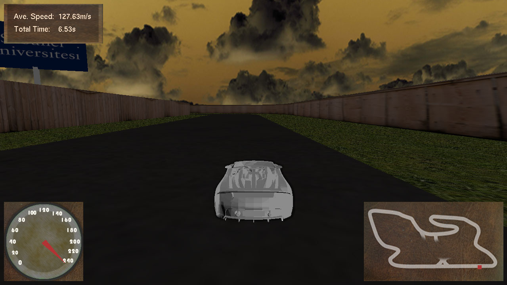

# OpenGL Racing Game

The game has been developed with OpenGl and C++. It is nothing fancy, this is an old project (you can tell by the use of immediate mode). 

Tested on Windows 10

### Here is an ugly example:

# Limitations

- The `freeglut.dll` version in the `build` folder is `x64`, you might need to download compiled library for `x86` systems 
- Collision detection is based on Axis Oriented Bounding Boxes, that's why you might occasionally hit somewhere off
- No shadows
- For some odd reason, textures on car does not appear
- Only image format can be read is `TGA`

# Install
Execute `./run.sh`
